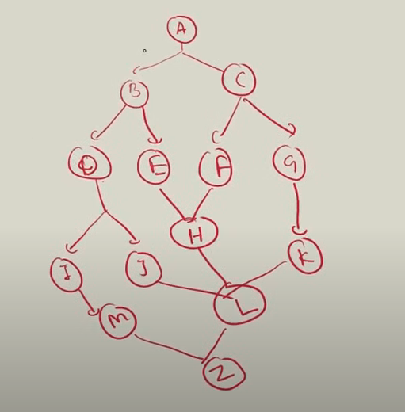
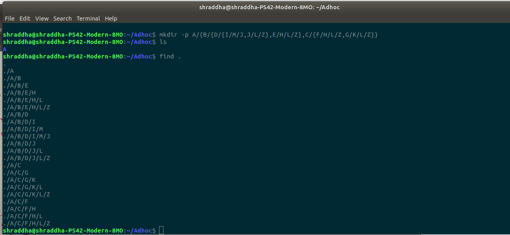
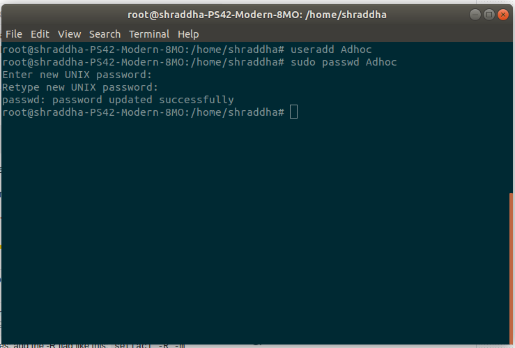
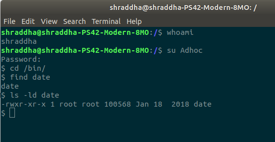
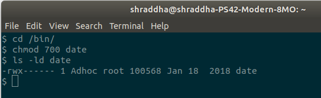
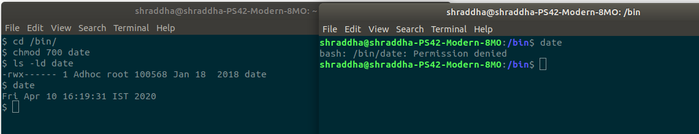
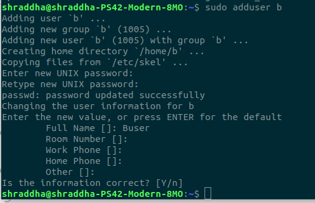
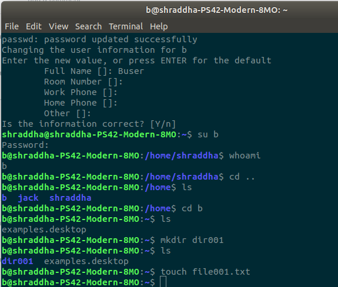
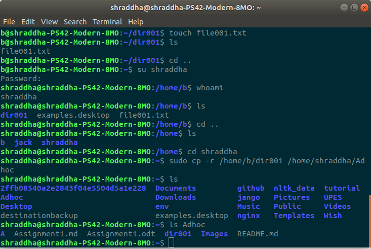
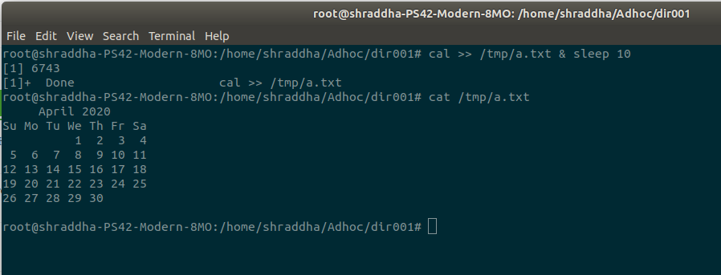

# :dart:	 Assignment 1

## 1. Create Directories Structure



### Command:
```
$ mkdir -p A/{B/{D/{I/M/J,J/L/Z},E/H/L/Z},C/{F/H/L/Z,G/K/L/Z}}
$ find . 
(or)
$ tree A
```



## 2. Permission for Date command

### Command:
```
$ adduser Adhoc
$ cd /bin/
$ find date
$ ls -ld date
$ sudo su
$ chown Adhoc date
$ chmod 700 date
$ chmod -rwx /bin/ ------> For removing permission for all other commands
```









## 3. User Data Copy

### Command:
```
$ adduser b
$ su b
$ mkdir dir001
$ su shraddha
$ sudo cp /home/b/dir001 /home/shraddha/Adhoc
```







## 4. Run cal command for 10 secs store output in a file

### Command:
```
$ cal >> /tmp/a.txt & sleep 10
$ cat /tmp/a.txt
```


