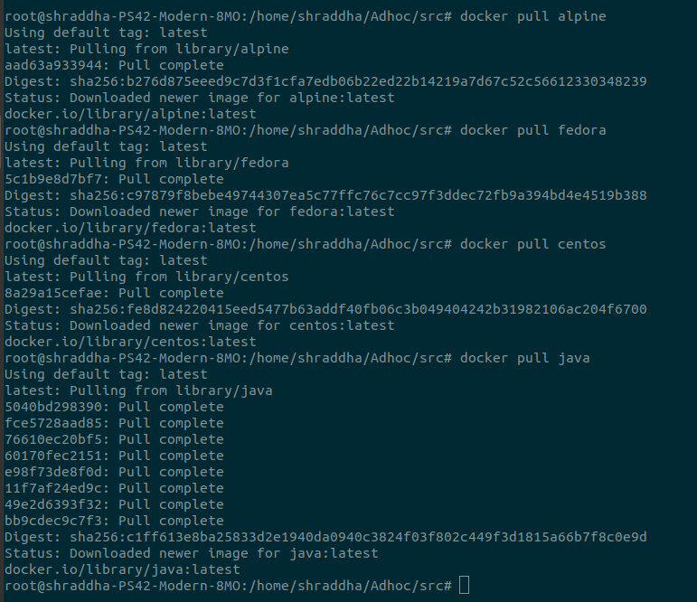
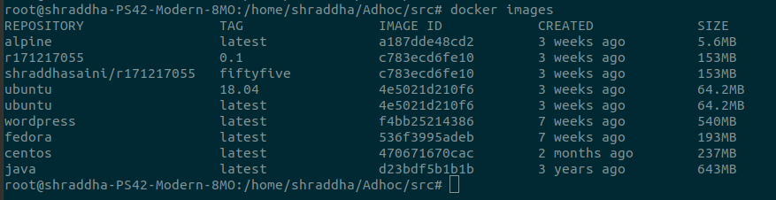
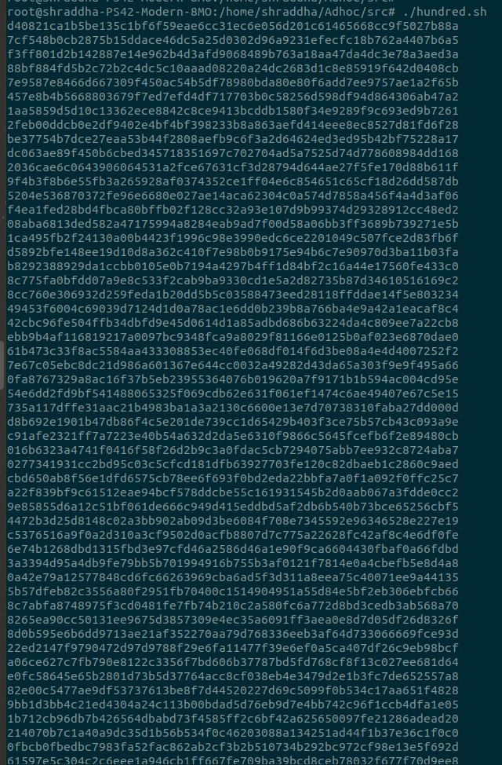
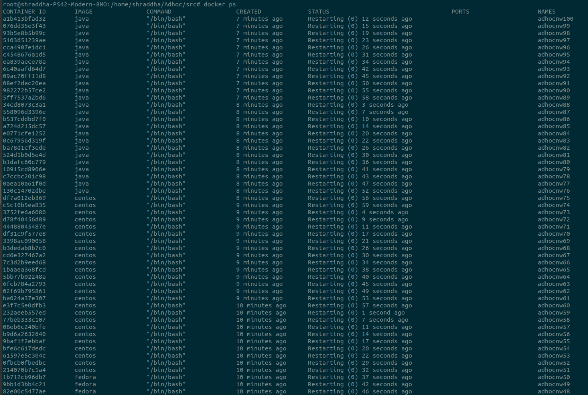
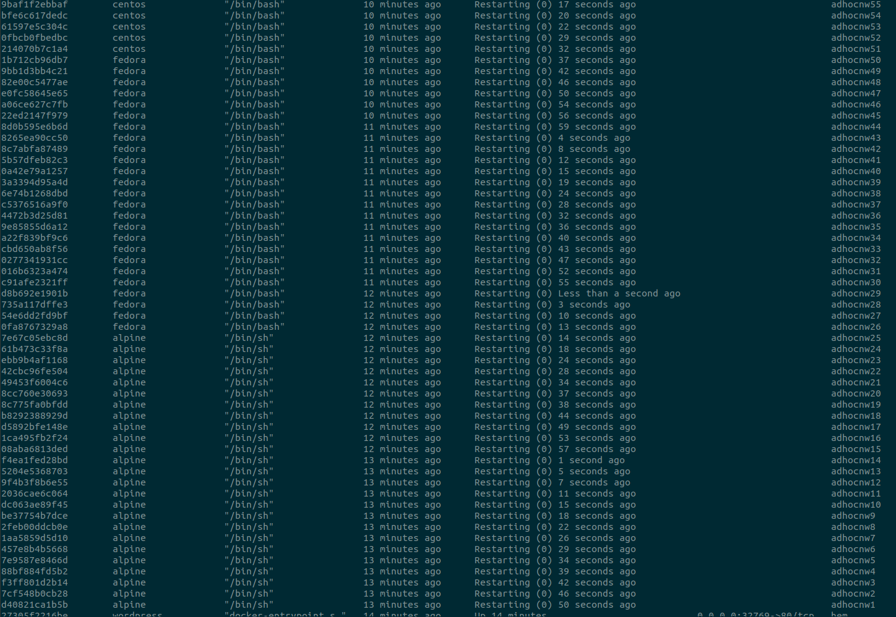
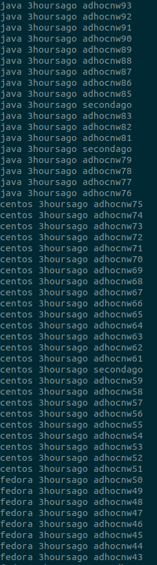

# Docker Deep Dive Task 1 :whale:
------
[Youtube Video for this task](https://www.youtube.com/watch?v=oxxAqV1p1Ew)
## :one: Multiple Containers
> Write Python code to create **100 Containers**. / bash script.
>
> Each **25 Container** will be from *Alpine, Fedora, centos* and *Java* image.
>
> All containers must be running forever even if you reboot your system.
>
> Name of container will be *Adhconw1* to *Adhocnw100*.
>
>> You can assume anything as a parent process.
>

### :atom: Commands:

```
$sudo su
$cd /home/shraddha/adhoc/dir001
$docker pull alpine
$docker pull fedora
$docker pull centos
$docker pull java
$docker images
$touch shraddha.sh
$atom shraddha.sh 
$chmod +x shraddha.sh
$./shraddha.sh
$docker ps
```
### :spiral_notepad: Shell Script:

[The Shell script to create 100 containers](https://github.com/Shraddhasaini/Adhoc/blob/master/src/hundred.sh)

```shell
#!/bin/bash
#

for i in {1..25}
    do docker run --restart=always --name adhocnw$i -P -d alpine
    sleep 3
done

for i in {26..50}
    do docker run --restart=always --name adhocnw$i -P -d fedora
    sleep 3
done

for i in {51..75}
    do docker run --restart=always --name adhocnw$i -P -d centos
    sleep 3
done

for i in {76..100}
    do docker run --restart=always --name adhocnw$i -P -d java
    sleep 3
done
```
### :bulb: Outputs:






## :two: Container Operations
>> From the above task
>
> Write a combination of *docker and OS commands* to get the list of **name, created** of all containers and store them in a text file
>

### :atom: Commands:

```shell
$docker ps -a | awk '{print $2 , $4 $5 $6 , $12 $13 }' > list.txt
$cat list.txt
```
### :bulb: Output:



## :three: Container GUI
>Run a container from **your** custom docker image
>
>> The parent process must be *firefox*
>

## :four: Consumption:
>> From task one
>
> Get **RAM and CPU consumptions** of the *100 containers* and stores in a file

### :atom: Commands:

```
$touch stat.sh
$atom stat.sh
$chmod +x stat.sh
$./stat.sh
```
### :spiral_notepad: Shell Script:
[The Shell script to store cpu consumption](https://github.com/Shraddhasaini/Adhoc/blob/master/src/stat.sh)
```shell
#!/bin/bash

for i in {1..100}
do
  docker stats adhocnw$i >> cpu.txt
done
```

### :bulb: Output:

```golang
CONTAINER           CPU %               MEM USAGE / LIMIT     MEM %               NET I/O             BLOCK I/O
adhocnw1              0.07%               796 KB / 64 MB        1.21%               788 B / 648 B       3.568 MB / 512 KB
.
.
adhocnw100              0.07%               2.746 MB / 64 MB      4.29%               1.266 KB / 648 B    12.4 MB / 0 B
```
